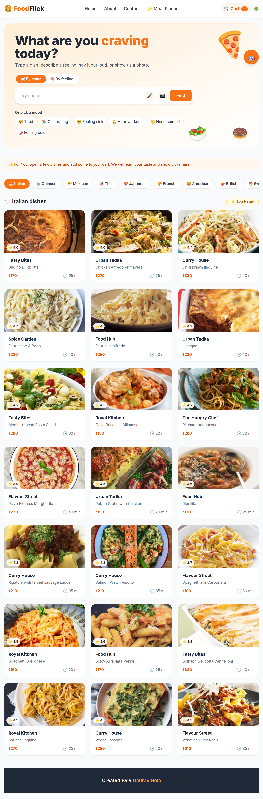
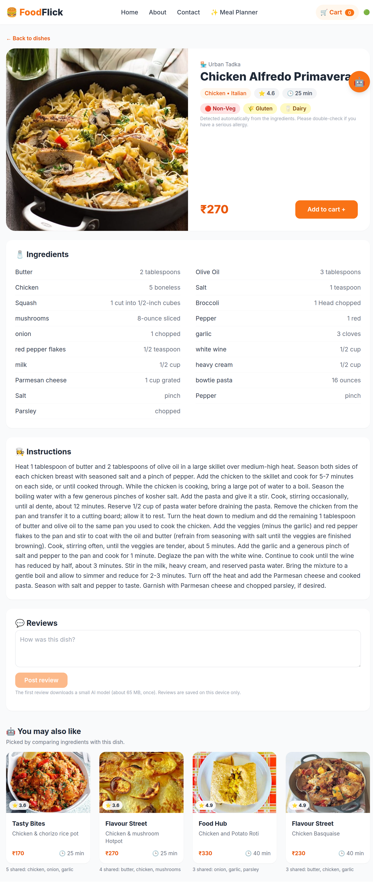
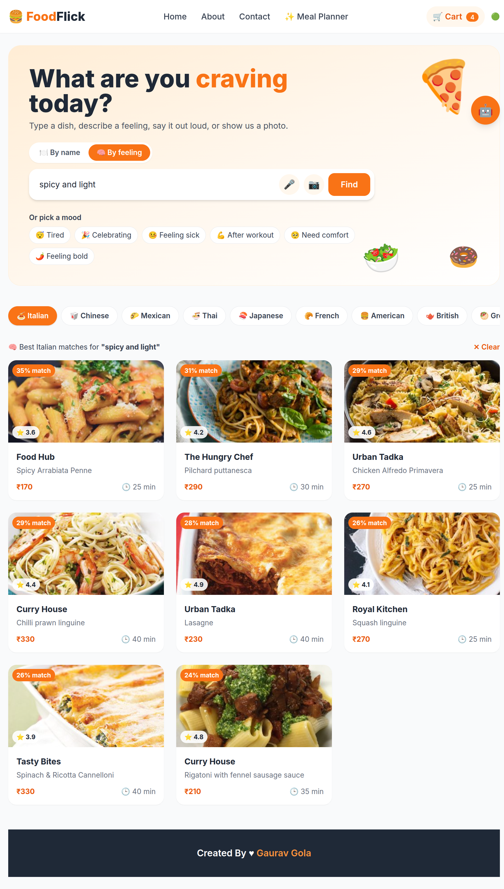
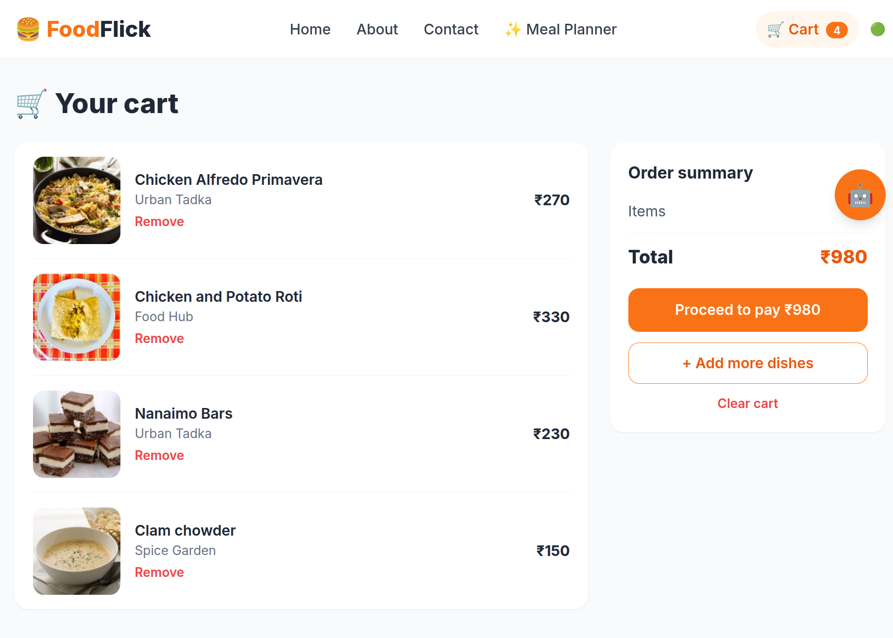

# 🍔 FoodFlick

**A food ordering app where the AI runs inside your browser.** Search for food by feeling, voice or photo, chat with an assistant that knows your cart, and get picks that learn your taste. There is no backend, no API key and no cost.

🔗 **Live demo:** https://YOUR-SITE-NAME.netlify.app
<!-- TODO: after deploying on Netlify, replace the link above with your real site link -->

| Home | Dish page |
|---|---|
|  |  |

| AI search results | Cart and payment |
|---|---|
|  |  |

---

## ✨ AI features

All of these run in the browser. When an AI model is not available, each feature falls back to simple rules, so the app keeps working.

| Feature | What it does | How it works |
|---|---|---|
| 🧠 **Smart search** ("By feeling") | Type "something spicy and light" and get matching dishes, even if the dish name has none of those words. | Every dish is turned into numbers (an *embedding*) with the MiniLM model. The query is turned into numbers too, and dishes are ranked by *cosine similarity*. |
| 😴 **Mood picks** | Tap Tired, Celebrating, Feeling sick, After workout, Need comfort or Feeling bold. | Zero-shot matching: each mood is one plain sentence that is compared with the dishes. No model was trained on moods. |
| 📷 **Search by photo** | Upload a food photo and see the closest dishes. | Zero-shot image classification with CLIP, which compares the photo with the dish names. |
| 🎤 **Voice search** | Say "show me pasta". | The browser's Web Speech API, plus a small function that removes filler words like "show me". |
| 🤖 **FlickBot** | A chat assistant that knows the dish you are viewing and your cart ("Is this vegetarian?", "What is my total?"). | The question's intent is found with embeddings (keyword rules as backup). The answer is then written from real data, so the bot cannot make facts up. |
| ✨ **For You** | Picks based on what you view and add to the cart. | Content-based personalization: a view gives 1 point and a cart add gives 3, saved in `localStorage`. There is no account and no server. |
| 🍽️ **Similar dishes** | "You may also like" on every dish page. | Jaccard similarity: shared ingredients divided by all different ingredients of both dishes. |
| 🥗 **Diet and allergen badges** | Veg / Non-Veg plus gluten, dairy, nuts, egg and seafood. | Rule-based keyword matching on the ingredient list, with ignore rules (for example, coconut milk is not dairy). |
| 💬 **Review sentiment** | Write a review and get a 😊 / 😐 / 😞 badge. | A DistilBERT sentiment model in the browser, with word lists as backup. Reviews are saved on the device. |
| 📅 **Meal planner** | "Plan a meal for 2 under ₹700." | Every combination of mains, one shared starter and one shared dessert is tried. Plans over budget are dropped and the best total rating wins. |
| 🛒 **Cart advisor** | Suggests a missing dessert or starter. If everything in the cart is vegetarian, it suggests only vegetarian dishes. | Rule-based: it checks which course is missing. |

## 🛍️ Shopping flow

- Browse **10 cuisines**, filter by **top rated**, and open a dish page with ingredients, instructions, reviews and similar dishes
- A cart with an order summary, remove and clear actions
- A **demo payment page** (UPI, card or cash on delivery) that ends with an "Order placed" screen. No real payment is made, and nothing is sent or saved.
- Responsive layout: checked on phone, tablet and desktop widths

## 🧠 How the AI runs

- The AI library is **Transformers.js**. It is loaded from a CDN **only when an AI feature is first used**, so people who never use AI never download it. (Parcel, the bundler, cannot bundle its ONNX engine, so the CDN also avoids a build error.)
- Models are downloaded **once** and cached by the browser: about 23 MB for search and chat, 65 MB for review sentiment and 90 MB for photo search.
- A progress bar shows the download. If a model cannot load, the feature switches to its rule-based backup and says so.

## 🧰 Tech stack

React 19 · Redux Toolkit · React Router 6 · Tailwind CSS 3 · Parcel 2 · Transformers.js (MiniLM, DistilBERT, CLIP) · Web Speech API · Jest + React Testing Library

## 📁 Project structure

```
src/
├── App.js                  routes and layout
├── components/             screens and UI
│   ├── Body.js             home page
│   ├── SearchHero.js       the one search bar (name, feeling, voice, photo, moods)
│   ├── RestaurantMenu.js   dish page
│   ├── Cart.js, Payment.js cart and demo payment
│   ├── FlickBot.js         chat assistant
│   └── ...
└── utils/                  the logic (no UI)
    ├── ml.js               loads and caches the AI models
    ├── semanticSearch.js, useSmartSearch.js, moods.js
    ├── photoSearch.js, useVoiceSearch.js
    ├── flickBot.js, tasteProfile.js
    ├── recommend.js, allergens.js, sentiment*.js
    ├── mealPlanner.js, cartAdvisor.js
    └── __tests__/          unit tests
```

## 🚀 Run it locally

```bash
git clone https://github.com/Gola1998/Foodflick-AI.git
cd Foodflick-AI
npm install
npm start          # opens http://localhost:1234
```

Other commands:

```bash
npm run build      # production build in /dist
npm test           # unit tests
```

## ⚠️ Good to know

- **Food data** comes from the free [TheMealDB](https://www.themealdb.com/) API. It only has dish names, photos, ingredients and instructions, so the **restaurant name, rating, price and delivery time are generated from the dish ID**. The same dish always shows the same values.
- **The first use of each AI feature is slower** because the model downloads once.
- **Voice search** works in Chrome, Edge and Safari (not Firefox) and needs `https` or `localhost`.
- **Allergen badges are a helpful guess**, not medical advice.
- **The payment page is a demo.** Please do not enter real card details.

## 🗺️ Roadmap

- Login with Firebase Auth, so the cart and "For You" taste follow the user
- Favourites and order history
- Dark mode

## 👤 Author

**Gaurav Gola** · [GitHub](https://github.com/Gola1998)
